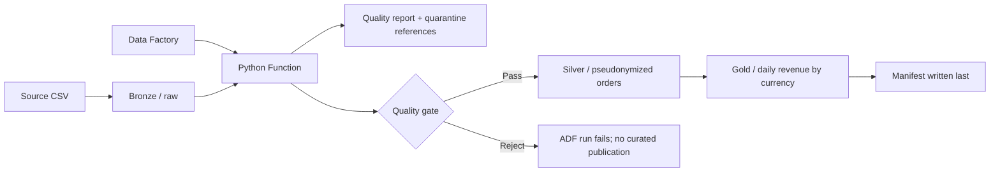

# Azure Retail Lakehouse

[](https://github.com/sjpagano/azure-retail-lakehouse/actions/workflows/ci.yml)

A small, inspectable data-engineering project: land retail orders, enforce a
versioned data contract, pseudonymize customer identifiers, quarantine bad rows,
and publish daily revenue aggregates only when the quality gate passes.

The same Python engine runs locally and inside an Azure Function. Bicep defines
Azure Data Factory orchestration, ADLS Gen2, managed identities, Key Vault,
audit diagnostics, and retention policies. **Deployed and end-to-end smoke-tested
in Azure on October 7, 2026**, with six screenshots documenting the core demo
acceptance checks. No subscription is needed for the local demo. All included
customer records are synthetic.

## Verified Azure deployment

The repository owner deployed and tested commit
[`2932f92`](https://github.com/sjpagano/azure-retail-lakehouse/commit/2932f92f1123044f479a8f187389daf1d0bc6e30).
The [deployment evidence and screenshot gallery](evidence/azure-deployment.md)
record the resources, exact run IDs, observed results, and verification limits.

| Core acceptance check | Observed Azure result |
|---|---|
| Clean-batch processing | Pipeline succeeded; 6 accepted, 0 rejected |
| Invalid-data rejection | Function evaluation succeeded; `RejectBatch` failed with `DQ_GATE_REJECTED`; 1 valid row, 5 rejected |
| Retry without extra published files | Clean retry succeeded; final counts were 2 quality reports and 1 file each in manifests, silver, and gold |
| Revenue reconciliation | Gold records match the clean quality report: EUR 35.00, GBP 15.00, USD 48.99 |

All core demo scenarios above have captured evidence. This is a historical
portfolio smoke test, not a production-readiness, compliance, or security-audit
claim. Cloud access-denial tests, exhaustive silver/log privacy inspection,
retention expiry, and load/fault testing are not evidenced by these screenshots.
Current live availability and resource cleanup status are not recorded.

## Try the entire pipeline locally

Use Python 3.12 (3.11+ supported). From this directory:

```bash
python -m venv .venv
source .venv/bin/activate
python -m pip install -e '.[dev]'
pytest
python scripts/demo.py
```

On Windows, activate with `.venv\Scripts\Activate.ps1` instead. The demo runs
clean and deliberately dirty batches, repeats the clean batch to prove retry
safety, checks revenue totals, and writes human-readable evidence under
`evidence/`. Its fixed pseudonym key is **public test data, never a production
secret**. Generated lake files go to ignored `out/demo/`.

Expected results:

| Batch | Input | Accepted | Rejected | Gate | Published |
|---|---:|---:|---:|---|---|
| Clean fixture | 6 | 6 | 0 | Passed | Silver, gold, manifest |
| Dirty fixture | 6 | 1 | 5 | Rejected | Quality report and quarantine only |

The clean batch produces **USD 48.99, EUR 35.00, GBP 15.00** in revenue.
Currencies are never added together. See the checked-in [demo evidence](evidence/).

For a custom **synthetic** CSV, set an environment variable and run the CLI:

```bash
export PSEUDONYM_KEY='local-demo-only-replace-with-a-random-key'
retail-pipeline --input examples/sales-clean.csv --as-of 2026-09-30 --output out/custom
```

PowerShell environment syntax: `$env:PSEUDONYM_KEY = 'local-demo-only-replace-with-a-random-key'`.
The CLI exits `0` when passed, `2` when the quality gate rejects a batch, or
nonzero on operational errors. Inputs with the same filename must have identical
bytes within one output directory; use a new immutable filename for corrections.

## Architecture



The deployment boundary starts at an already-landed bronze blob. ADF accepts
`blob_name` and a reproducible business date `as_of`, calls the Function, then
fails the run if the report says `rejected`. The runbook includes the source
upload step. There is no pretend connector to a real retailer, scheduled trigger,
Power BI dashboard, or Microsoft Purview deployment.

Outputs use deterministic batch IDs derived from source bytes/name, business
date, contract/policy version, and a key fingerprint. Retrying identical work
does not overwrite or duplicate objects. Consumers must discover batches through
`manifests/`, not by scanning `silver/` or `gold/`. This avoids reading incomplete
uploads; it is **not** a global exactly-once delivery or cross-batch deduplication
claim. See [design decisions](docs/architecture.md).

## Quality and governance

- [Data contract and quality rules](docs/data-quality.md): exact schema, checks,
  5% rejection threshold, reconciliation, and failure behavior.
- [Governance and catalog](docs/governance.md): classification, ownership,
  access matrix, lineage, retention, secret rotation, and production gaps.
- [Azure deployment and operations](docs/azure-runbook.md): prerequisites,
  deployment, Function-key bootstrap, clean/rejected/retry acceptance checks, cleanup.
- [Azure deployment evidence](evidence/azure-deployment.md): dated test record,
  six original screenshots, run IDs, and per-currency reconciliation.
- [Learning guide](docs/learning-guide.md): demonstrations, extensions, interview
  questions, and resume wording with no invented business impact.

## Automated verification

The initial local run passed **54 tests with 99.12% line coverage (226/228)**.
The coverage gate is 85%. Tests execute real parsing, file publication, CLI
behavior, and HTTP-handler logic; Azure SDK calls are mocked. GitHub Actions runs
pytest, Ruff lint/format checks, deployment packaging, and Bicep compilation.
It uploads test/coverage artifacts and does not create Azure resources. The
separate owner-run Azure smoke test is documented in the deployment evidence;
the automated test suite still uses mocked Azure SDK calls.

```bash
ruff check .
ruff format --check .
pytest --junitxml=test-results.xml
python scripts/package_function.py
az bicep build --file infra/main.bicep
```

The deployment package is `dist/function.zip`, source only; Azure performs the
Linux dependency build. Local coverage: `htmlcov/index.html`.

## Scope and limitations

This is a bounded batch demonstration (10 MiB / 50,000 records), not a distributed
Spark workload. Storage immutability is enforced by application create-only
writes, not WORM policies. Public service endpoints remain enabled with
authentication; private networking, alert rules, enterprise IAM, and independent
security review are future work. Pseudonymization is not anonymization or proof
of regulatory compliance. The fixtures use a fixed business date, so they remain
reproducible without weakening the date-quality rule.

Azure deployment incurs usage charges. Review the [runbook](docs/azure-runbook.md)
before deploying. Documentation links to the relevant Microsoft references;
no cloud credentials or real customer data belong in this repository.
