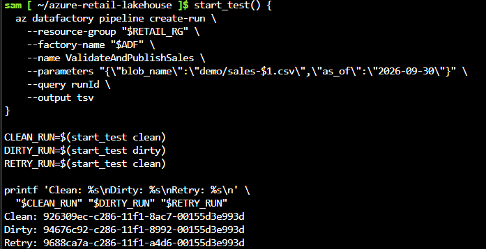
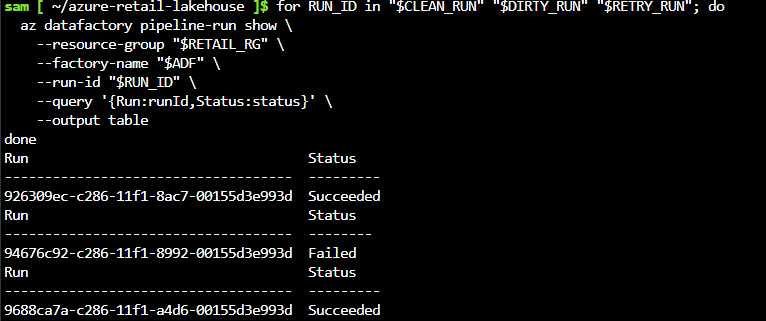
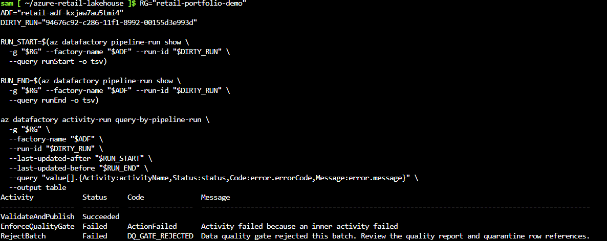
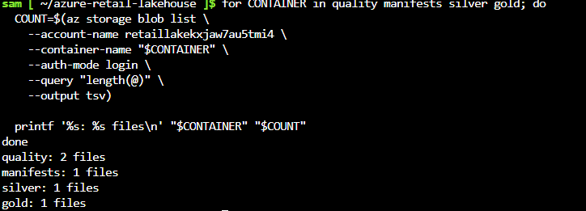
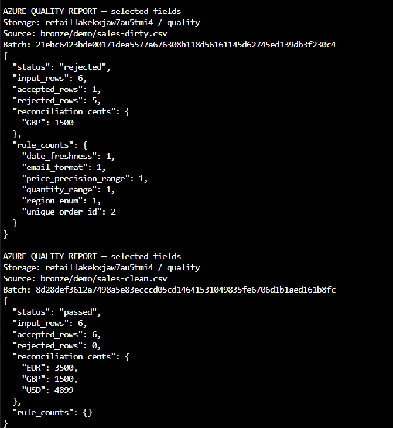
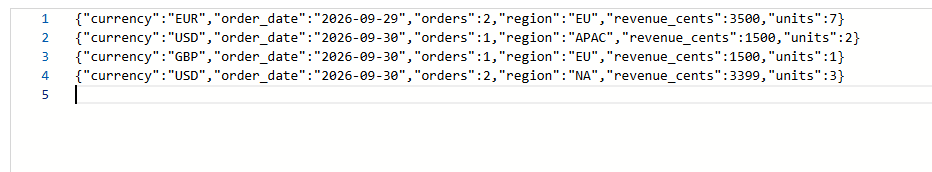

# Azure deployment validation — October 7, 2026

**Outcome: all four core demo acceptance areas are evidenced:** clean processing,
intentional quality-gate rejection, retry behavior without extra published output
files, and per-currency revenue reconciliation.

This is a historical, owner-run Azure smoke test using synthetic data. It is not
a production certification, an independent security audit, or a live service
status page. Current resource availability and teardown status were not recorded.

## Deployment context

| Item | Recorded value |
|---|---|
| Evidence capture date | October 7, 2026, from owner-supplied screenshot filenames |
| Tested source commit | [`2932f92f1123044f479a8f187389daf1d0bc6e30`](https://github.com/sjpagano/azure-retail-lakehouse/commit/2932f92f1123044f479a8f187389daf1d0bc6e30) |
| Resource group | `retail-portfolio-demo` |
| Function App | `retail-quality-kxjaw7au5tmi4` |
| Data Factory | `retail-adf-kxjaw7au5tmi4` |
| Lake storage account | `retaillakekxjaw7au5tmi4` |
| Pipeline | `ValidateAndPublishSales` |
| Inputs | `bronze/demo/sales-clean.csv` and `bronze/demo/sales-dirty.csv` |
| Business date parameter | `2026-09-30` (fixture date, not deployment date) |
| Contract / transform | `1.0.0`, as reported in the owner's clean-report JSON |

The owner supplied the resource names and tested commit from Cloud Shell, then
captured the CLI run results, activity errors, storage counts, downloaded quality
report summaries, and the gold blob's displayed contents. Exact Azure UTC start
and end timestamps and an ARM deployment-status screenshot were not supplied;
the successful pipeline executions demonstrate a functioning deployed path.

## Run ledger

| Scenario | Azure Data Factory run ID | Observed status | Interpretation |
|---|---|---|---|
| Clean input | `926309ec-c286-11f1-8ac7-00155d3e993d` | Succeeded | Accepted batch processed through the Azure pipeline |
| Dirty input | `94676c92-c286-11f1-8992-00155d3e993d` | Failed | Expected data-quality rejection, not a Function execution failure |
| Identical clean retry | `9688ca7a-c286-11f1-a4d6-00155d3e993d` | Succeeded | Repeat execution succeeded without extra final published files |

The run-command screenshot maps each ID to its scenario and shows the same
business date for all three. The dirty run's activity results show:

- `ValidateAndPublish`: **Succeeded**.
- `EnforceQualityGate`: **Failed**, with the parent `ActionFailed` wrapper.
- `RejectBatch`: **Failed**, with **`DQ_GATE_REJECTED`** and the expected quality
  rejection message.

Therefore the dirty run is a successful negative test: evaluation completed,
then orchestration correctly rejected the batch.

## Acceptance coverage

| Check | Expected | Observed | Evidence |
|---|---|---|---|
| Clean pipeline | Succeeded | Succeeded | [Run statuses](#2-run-statuses) |
| Clean quality | Passed; 6 input, 6 accepted, 0 rejected | Exact match; no rule violations | [Quality reports](#5-quality-reports) |
| Dirty pipeline | Fail explicitly at the quality gate | `RejectBatch` / `DQ_GATE_REJECTED`; evaluation succeeded | [Failure details](#3-intentional-quality-gate-rejection) |
| Dirty quality | Rejected; 6 input, 1 valid, 5 rejected | Exact match, with rule counts | [Quality reports](#5-quality-reports) |
| Clean retry | Succeeded; no additional curated publication | Succeeded; one final manifest, silver file, and gold file | [Run statuses](#2-run-statuses), [output counts](#4-final-output-counts) |
| Revenue totals | Gold and clean report agree independently for each currency | EUR 3500, GBP 1500, USD 4899 cents | [Reports](#5-quality-reports), [gold records](#6-published-gold-records) |

### Publication counts

After the clean, dirty, and retry runs, the observed container counts were:

| Container | Files |
|---|---:|
| quality | 2 |
| manifests | 1 |
| silver | 1 |
| gold | 1 |

Combined with the quality reports and displayed clean gold records, this supports
the expected single curated publication for these fixtures. The screenshots show
final counts, not a before/after ETag or byte-hash comparison. They do not prove
global exactly-once delivery, cross-batch deduplication, or physical immutability.
Quarantine file counts and contents were not captured.

### Revenue reconciliation

The gold screenshot contains four groups:

| Order date | Region | Currency | Orders | Units | Revenue cents |
|---|---|---|---:|---:|---:|
| 2026-09-29 | EU | EUR | 2 | 7 | 3500 |
| 2026-09-30 | APAC | USD | 1 | 2 | 1500 |
| 2026-09-30 | EU | GBP | 1 | 1 | 1500 |
| 2026-09-30 | NA | USD | 2 | 3 | 3399 |

Gold order counts sum to **6**, matching the clean report's accepted rows.
Gold revenue reconciles to that report as follows:

- EUR: 3500 cents = **35.00**.
- GBP: 1500 cents = **15.00**.
- USD: 1500 + 3399 = 4899 cents = **48.99**.

No monetary total mixes currencies. The dirty report's GBP1500 value is the
computed subtotal for its one valid row; it is not evidence that the rejected
batch published gold data.

The dirty report records `date_freshness: 1`, `email_format: 1`,
`price_precision_range: 1`, `quantity_range: 1`, `region_enum: 1`, and
`unique_order_id: 2`. A rejected row can violate multiple rules, so these counts
need not sum to the number of rejected rows.

## Original screenshot gallery

All six owner-supplied PNGs are included unchanged under descriptive filenames.
Copies were checked against their source files using SHA-256. The
[screenshot manifest](azure-2026-10-07/screenshots.json) records the original
filenames and full hashes. These hashes verify preservation of the supplied
files, not independent authentication of the Azure account or capture time.

### 1. Run commands and scenario IDs

Shows the pipeline parameters and the clean/dirty/retry-to-run-ID mapping.

### 2. Run statuses

Shows Succeeded / Failed / Succeeded for those three run IDs.

### 3. Intentional quality-gate rejection

Shows successful evaluation followed by the intended `DQ_GATE_REJECTED` failure.

### 4. Final output counts

Shows two quality reports and one object each in manifests, silver, and gold.

### 5. Quality reports

Selected fields were printed from downloaded Azure quality blobs. Storage name,
source path, batch ID, decision, counts, totals, and rule violations remain
visible. This is a labeled summary, not a complete raw report export.

### 6. Published gold records

The owner supplied this crop of the Azure blob's editor view. It shows all four
gold records; the crop itself does not display the storage account or blob path.
Its contents match the clean quality report and synthetic fixture expectations.

## Scope of the claim and remaining checks

The captured evidence supports **deployed and end-to-end smoke-tested in Azure**
for the documented fixtures. Local automated tests and Bicep compilation remain
separate evidence, not substitutes for cloud checks.

The following are not established by this screenshot set:

- Exhaustive privacy inspection of cloud silver rows, quarantine, and logs.
- Negative authorization tests, such as denied anonymous access, denied bronze
  writes by the worker, or denied HMAC-key access by Data Factory.
- Expired-retention cleanup, secret rotation, disaster recovery, cloud fault
  injection, performance/load limits, or a security/compliance audit.
- Byte-for-byte source or retry-output checksum verification in Azure.
- Current uptime, actual spend, or completed resource teardown.

These are follow-up hardening/verification tasks, not claims hidden behind the
successful smoke test. See the [runbook](../docs/azure-runbook.md) and
[governance boundaries](../docs/governance.md) before using real data or
operating unattended.

## Portfolio summary

> Deployed and end-to-end smoke-tested an Azure Data Factory, Azure Functions,
> and ADLS Gen2 retail pipeline. Verified clean-batch processing, intentional
> data-quality rejection, retry behavior without additional published files,
> and per-currency revenue reconciliation; documented results with run IDs and
> six original screenshots for source commit `2932f92`.

This statement describes a personal demonstration environment, not production
traffic, financial impact, or regulatory compliance.
